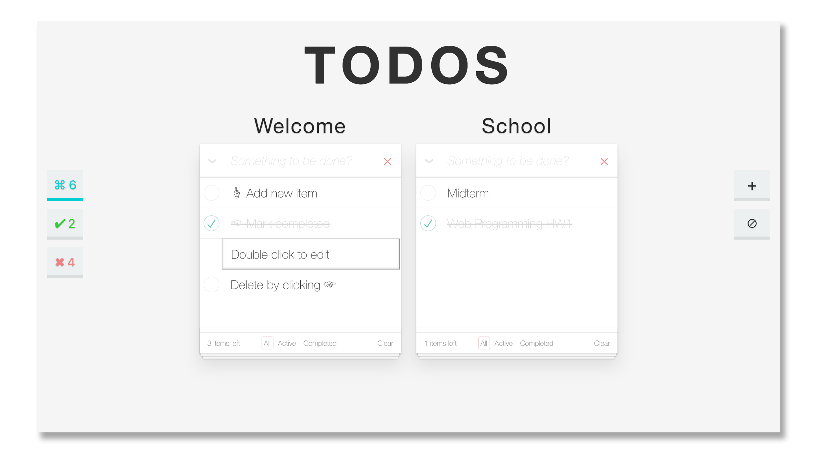

TODOs
=========
  
  

## Demo

A working live demo [http://dtk0528.github.io/TODOs](http://dtk0528.github.io/TODOs)

## Features

* Create multiple todo lists
* Modify the title of each todo list
* Remove a todo list
* Add and delete todo items
* Mark completed items
* Show how many completed and uncompleted items
* Save lists to cookies
* Clean design

---

## Setup

#### Get the source code  

	git clone https://github.com/dtk0528/TODOs.git
	cd todos
	
#### Download and install all the dependencies

	yarn install

  
---
	
## Usage

#### Start and open the browser

	yarn start

---

## Built With

* [React](https://facebook.github.io/react/) - A JavaScript library for building user interfaces

---

## License

This project is under the MIT license. You are free to do whatever you want with it.
